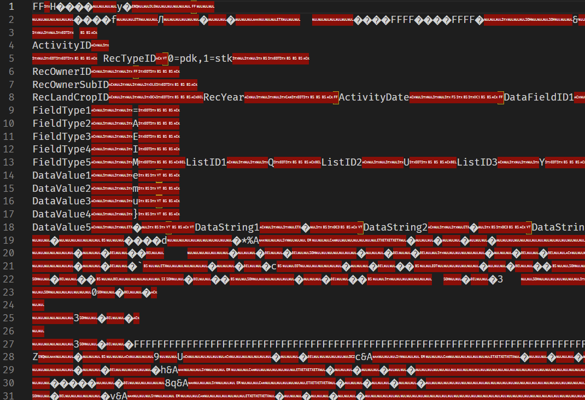
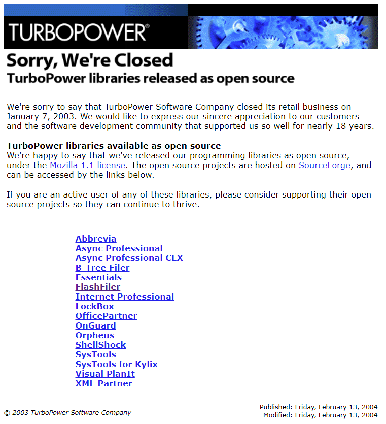
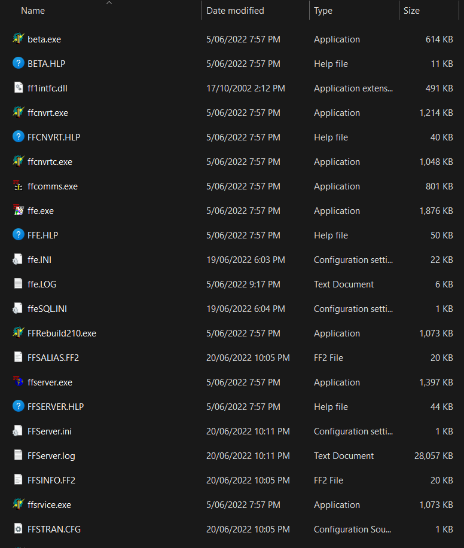
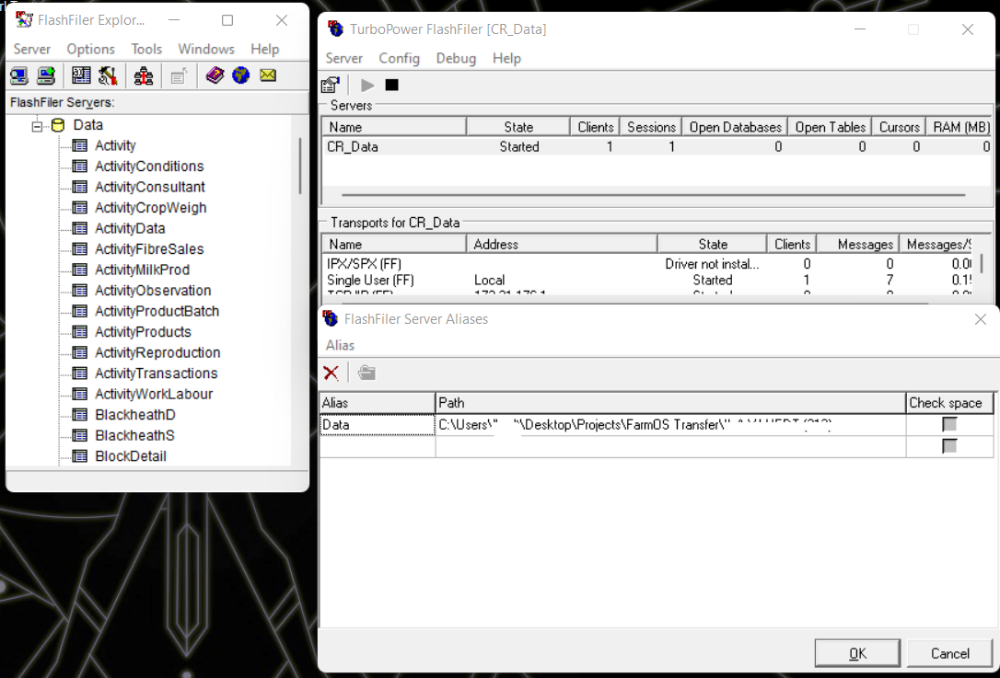
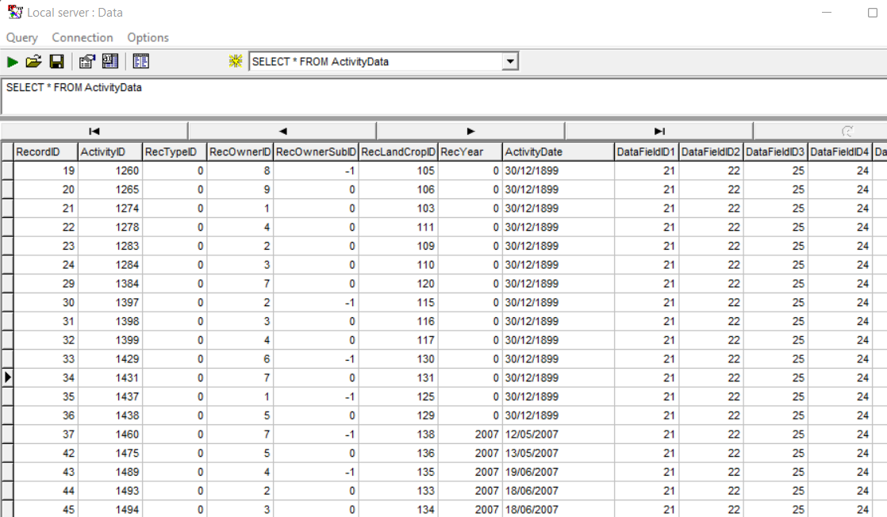
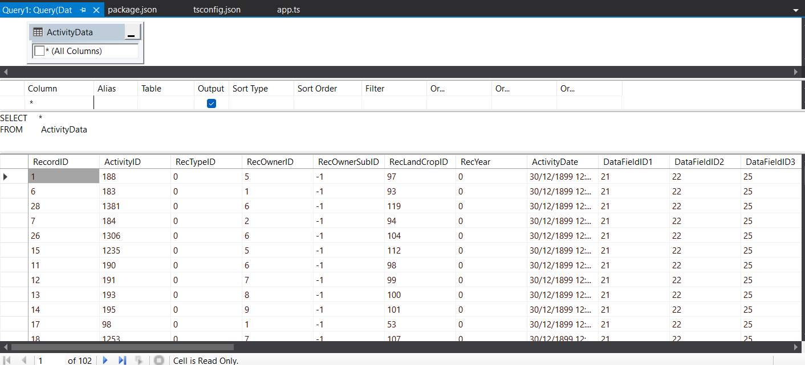

## What's in a backup?

As stated before, these backup files we had access to weren't formatted nicely as text like JSON or something. Teenage me couldn't figure it out, but the people I hang out with say I'm clever, so surely I can figure this one out.

Extracting the `.zip` file shows me... a bunch of `.FF2` files.

```sh
lydia@Athena:~/backup_extract$ ls
 Activity.FF2          
 ActivityConditions.FF2
 ActivityFibreSales.FF2
 ActivityMilkProd.FF2
 ActivityObservation.FF2
 ActivityProductBatch.FF2
 ActivityProducts.FF2
 ActivityReproduction.FF2
 ActivityTransactions.FF2
 ActivityWorkLabour.FF2
 BlockDetail.FF2
 BlockList.FF2
 CoverList.FF2
 CropList.FF2
 CropSummary.FF2
 CropVariety.FF2
 D.FF2
 ...
```

Welp my vague hope for a SQLite extract seems to have gone out the window, but that wasn't really based in reality anyway.

Experience tells me that these are probably database table extracts, but opening one up in a text editor shows that it's not exactly plaintext.

<figure>
    
    <figcaption>Opening an .FF2 as UTF-8 doesn't seem like it'll help much</figcaption>
</figure>

There seems to be text data down lower, but I don't feel confident trying to get anything meaningful out of these directly.

Maybe some google-fu will tell us some more about the file format. [FileExt.com](https://filext.com/file-extension/FF2) seems to think it's a file associated with FlashFiler, although I'm not very convinced at their claim to be able to decode it in a browser.
Sounds like the FlashFiler company, [Turbopower](http://www.turbopower.com/), has gone out of business and their site no longer works. Bugger.

<figure>
    
    <figcaption>Who's even paying to host this domain? Santa Claus?</figcaption>
</figure>

Googling FlashFiler, the first link is to a [SourceForge repo](https://sourceforge.net/projects/tpflashfiler/), which has this lovely little tag line:


"FlashFiler is a client-server database for Borland Delphi & C++Builder.
It features a component-based architecture & the server engine can be embedded in your applications. FlashFiler is easy to configure, performs well, & includes SQL support."


Hmm unfortunately, I know bugger all about Delphi. They provide `.exe` files in the repo though, that's pretty neat!

<figure>
    
    <figcaption>The icons look like something out of MS DOS, but hey, it's worth a start!</figcaption>
</figure>

I don't really know what anything here does, and all the internal docs here are the long dead `.hlp` extension. I clicked around a bit, but I ended up needing to download the PDF documents in the SourceForge repo to get anywhere.
The gist is, you open the `ffserver.exe` file, create an "alias" that points to the folder containing your `.FF2` files, and then connect to that server with the `ffe.exe` program.

<figure>
    
    <figcaption>Holy shit it actually freaking works?</figcaption>
</figure>

Okay I am pleasantly surprised that this software still works on Windows 11. I can even query the DB using regular old SQL and get some rows back! At this point I thought I had the whole project in the bag.

<figure>
    
    <figcaption>Some of the dates are a bit funny, but hey, I can read the data now!</figcaption>
</figure>

I put the tools down for a weekend or two.

## Plain Text is a Common Courtesy

Okay so I can read all the paddock records now, in their de-constructed state. I'm a Melbournian, so I think I can make something out of this :p

One would think that you can easily export a query's results to some kind of plaintext output now, right? Like they're right there in HD? There's even a "Save" button! But it only saves the query, not the results, which I really don't care about.

Googling about, there doesn't really seem to be any Clients existing for any language I have any experience in, only for the Delphi IDE, which I don't really feel like downloading if at all possible. However, with enough searching, and a little bit of swearing, I eventually found a Freeware version of an [ODBC Driver](https://www.nexusdb.com/support/index.php?q=node/542) on this NexusDB Website I initially thought was unrelated.

They'll come up later, but for now I won't look a gift horse in the mouth.

I install it, and with a bit of screwing about with Connection Strings, I eventually get it to connect properly. Score!
I mess about with it a bit and see if I can't get the data to import directly into Excel or something. Excel doesn't seem to keen to read the data, but it's an old driver so fair enough. Visual Studio 2019 seems happy enough to connect to it though? The data source explorer bugs out a bit, but it seems happy enough to connect and query the DB, so I rest easy, thinking I am close to home.


<figure>
    
    <figcaption>We can see at least some data out of the ODBC Driver, even if it's not showing column names.</figcaption>
</figure>

Visual Studio is crashing a little while I'm doing this, but I don't clock it as weird at the time. I put the tools down for another weekend.
