## What even is a NexusDB?

So in this blog series, I've mentioned this site a few times.
But you'll have to forgive me for not really being keen to try out too many links.
It's so hard to parse which ones are actually dead :joy:.

<figure>
    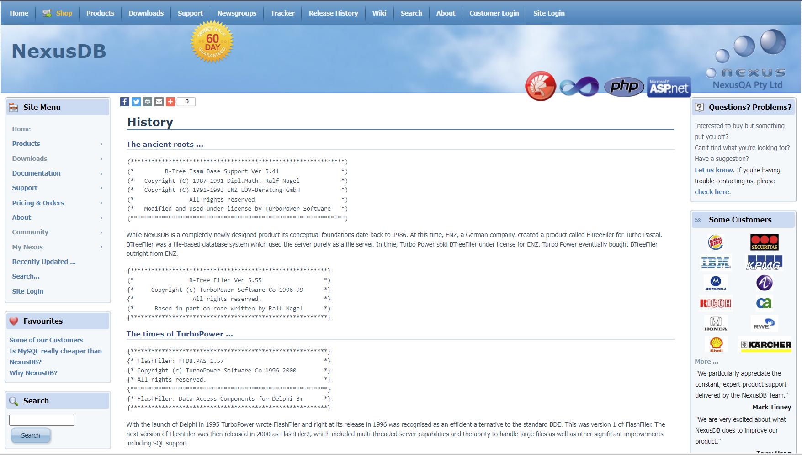
    <figcaption>Their homepage looks like it hasn't been updated since 2004</figcaption>
</figure>

I was totally convinced that trying their software would be a dead end. 
Actually I thought the site still being actively hosted was an accident - someone at a company that bought them out must have some ancient server running that also happens to be hosting this site! 
Right? Especially since I can't sign up for the forums! It's all an accident surely!

And given the site can't send me emails, surely the "Free Trial" software won't be able to either.

Not so! In fact, it took me half a dozen visits to notice this little window:

<figure>
    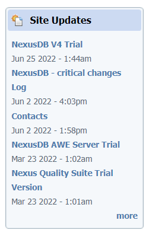
    <figcaption>Updates? In 2022? Including a Changelog? Paint me Pink!</figcaption>
</figure>

Actually, a page with [Contacts](https://nexusdb.com/support/index.php?q=node/555) might be handy. 
This is still blowing my mind a little.

Wait the company is based in Queensland? Now I'm truly shocked!


<figure>
    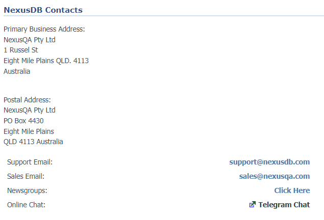
    <figcaption>Having a Contact site with real people's names? This seems truly foreign now</figcaption>
</figure>

What got me intrigued here was the telegram chat. I don't even have telegram, but if it helps, why not!

I joined, and asked about being able to join the newsgroup to actually download the file, but no-one really seemed able to keen to upload the file to telegram, or fix the email client bug. 
They pointed me in the direction of the Open Sourced FlashFiler binaries I had already tried.
In fairness to them, no-one claimed they'd support FlashFiler, and they were very nice so I couldn't really be annoyed.

## Stop putting off the Inevitable - Download NexusDB Today!

However, this gave me the idea to just... try NexusDB. 
I've seen a few mentions around to use some "nxImporter" program to make it all go. 
I didn't think I could find it (it's not in their 'bonus downloads' page) but what's the harm? I have nothing left to lose.

Assuming that the "Trial Version" of NexusDB 4 would just not let me past the licensing window (has anything up to this point led me to believe licenses would work properly after 20 years?), I tried out one of the [daily builds](https://www.nexusdb.com/downloads/dailybuilds/) that I assumed might be okay. 
From memory, it was for NexusDB 3, and I really didn't have much luck. 
I eventually got it to run, but I also had to set up a custom user with the privilege to log in as a service or something like that. 
Initially I also tried to make it directly alias the FF2 files, which was silly. 
Obviously it didn't work, but any references to it unfairly assumed knowledge IMO.

## Why not try the version that's actually in support, dingbat?

I eventually plucked up the courage to give it one more go, after licking the wounds of failure for another few days, and downloaded the trial of [NexusDB V4](https://nexusdb.com/support/index.php?q=node/550). 
It definitely asks me for an email address, and actually does send me an email, which I discover in my junk folder a little while after, but no matter.
It's a surprise to be sure, but a welcome one!

I root around in the provided files, hoping to find this mysterious `NxImporter` program, but no luck. Let's just install it anyway, and see what happens.


<figure>
    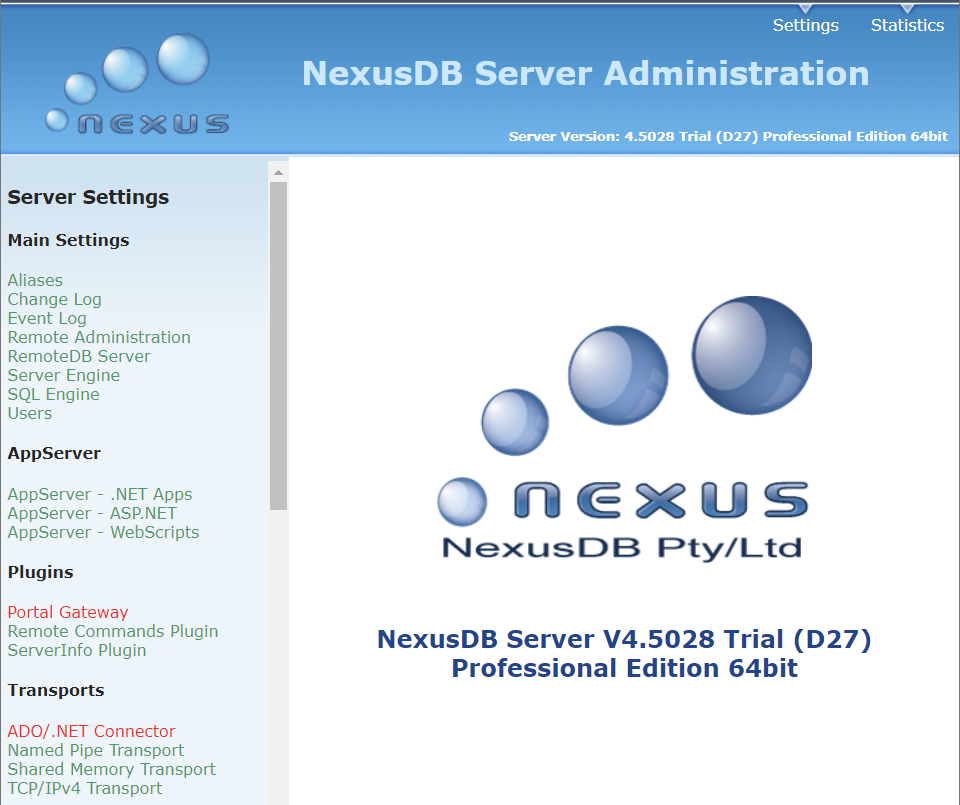
    <figcaption>The admin portal works. Hey's it's Professional... And 64-bit!</figcaption>
</figure>

Okay I got this far with the daily build, but let's go and make ourself an alias anyway.

<figure>
    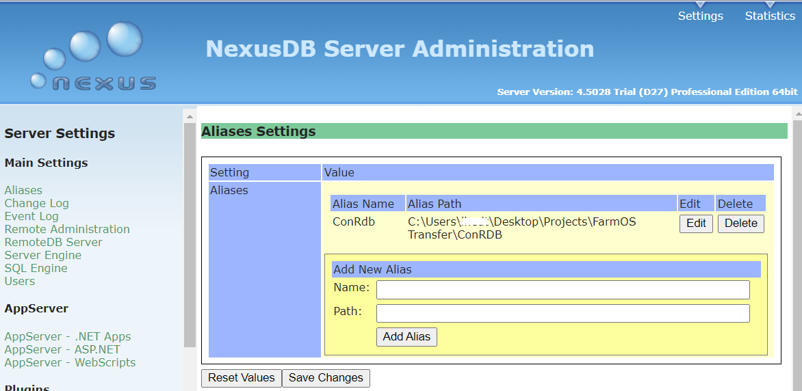
    <figcaption>You have to add the alias and *then* click Save Changes, obviously</figcaption>
</figure>

## Importing highly legal goods and data

Okay now just to find this freaking importer program.
Even going back now, it's not easy to find. 
Fortunately for me, [I found it on this page](https://www.nexusdb.com/support/index.php?q=node/26890). 
Let's cross our toes and hope for the best!


If, in the future from now, the above link is broken, feel free to email me, I've kept copies of everything here.


Hey Hey Hey, it works!

<figure>
    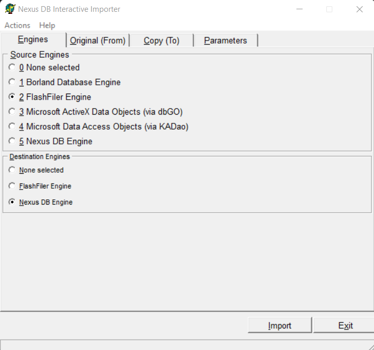
    <figcaption>Actually this thing supports a lot of different DBs!</figcaption>
</figure>


Next we select the Importer login mode - we'll chose "Single User" mode because we have the FF Server running, and I trust it to some extent.

<figure>
    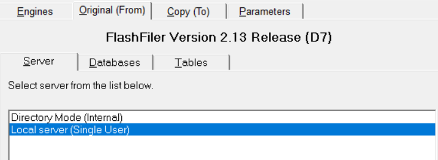
    <figcaption>Let's use the running server</figcaption>
</figure>

Select the database that's listed under the `Databases` tab, and then tab over to the `Tables` tab and select all.

<figure>
    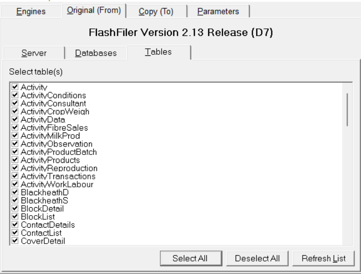
    <figcaption>Select all the tables!</figcaption>
</figure>

Now we need to select a target DB Instance. Tab over to `Copy (To)`, and select one of the running NexusDB Instances. I'm gonna go for the one with my laptop's name but I have no reason to believe the others won't work.

<figure>
    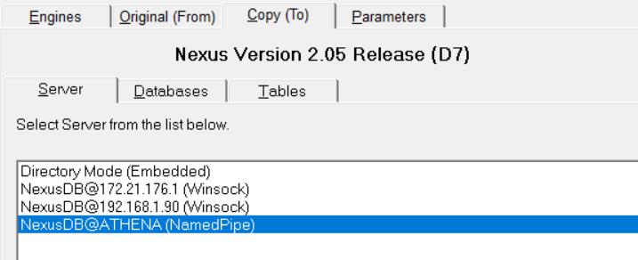
    <figcaption>Select a Database Instance to copy into!</figcaption>
</figure>

Now we simply select the Target DB Alias we made before back in the admin portal, and then tab over to the `Tables` tab to make sure we can see all the table names we expect.

<figure>
    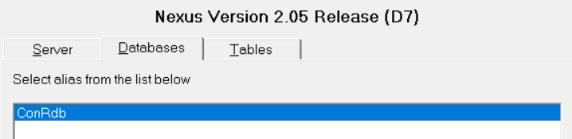
    <figcaption>Select the target DB Alias we made before</figcaption>
</figure>

<figure>
    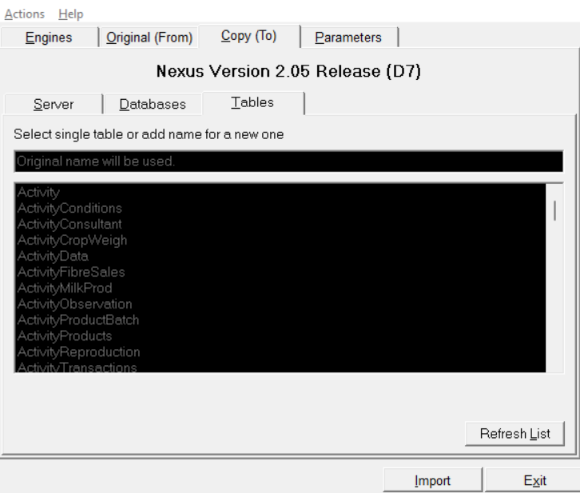
    <figcaption>Make sure we can see the tables we expect, then hit Import!</figcaption>
</figure>

Hit Import, and wait for it all to go!

<figure>
    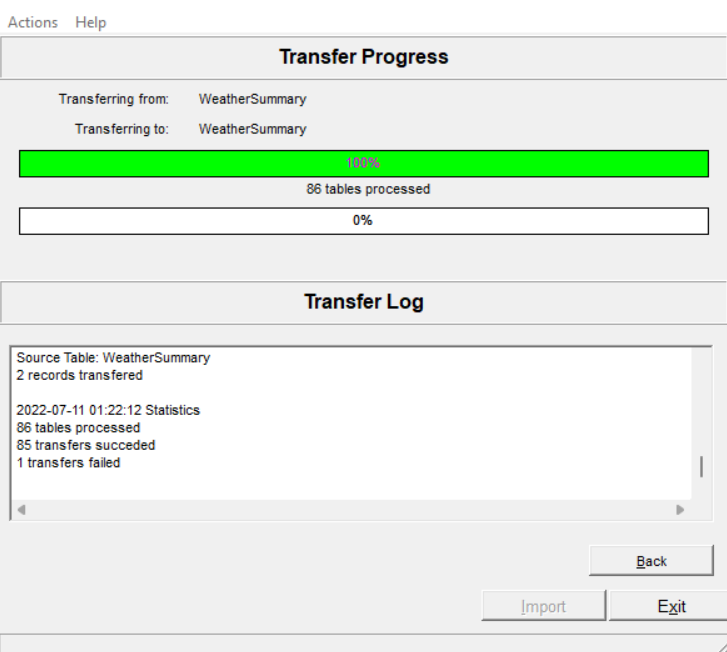
    <figcaption>All tables imported</figcaption>
</figure>

We can see I have one failed row, from memory it had some odd date issue that I don't really care about.

We seem to get all our tables from before!

```bash
lydia@Athena:~/ConRDB$ ls
'$SQL$FUNCTIONS.nx1'        CoverDetail.nx1           
'$SQL$PROCEDURES.nx1'       CoverList.nx1             
'$SQL$TRIGGERS.nx1'         CropList.nx1              
'$SQL$VIEWS.nx1'            CropSummary.nx1           
 Activity.nx1               CropVariety.nx1           
 ActivityConditions.nx1     D.nx1                     
 ActivityConsultant.nx1     DryMatterEquations.nx1    
 ActivityCropWeigh.nx1      FarmAssetBatch.nx1       
 ActivityData.nx1           FarmAssetEvents.nx1     
 ActivityFibreSales.nx1     FarmAssets.nx1         
 ActivityMilkProd.nx1       FarmContracts.nx1     
 ActivityObservation.nx1    FarmIDNumbers.nx1   
 ActivityProductBatch.nx1   FarmProperty.nx1    
 ActivityProducts.nx1       GrazingRecords.nx1  
 ActivityReproduction.nx1 
 ActivityTransactions.nx1 
 ActivityWorkLabour.nx1
 ...
```

They definitely have data in them, but opening them as UTF-8 is even more unreadable than before.

Now just to turn all this into some kind of plaintext.

There's a few driver options listed in the admin portal, but I already have a sample ODBC reader app written, so let's use the free trial of the [ODBC Driver](https://www.nexusdb.com/support/index.php?q=odbctrial). 
NexusDB say you can download it from [DevArt](https://www.devart.com/odbc/nexusdb/), and it's a free trial for 30 days.
Oh good, another signing up.


Pro tip, they also send a lot of sales emails to the email address you put in here. One of them will be an access code, but the rest are assuming you're a Delphi Dev with money. Do with this what you will.


Installing the driver we can see it's 64 bit!! I can easily add it to the system's ODBC portal:

<figure>
    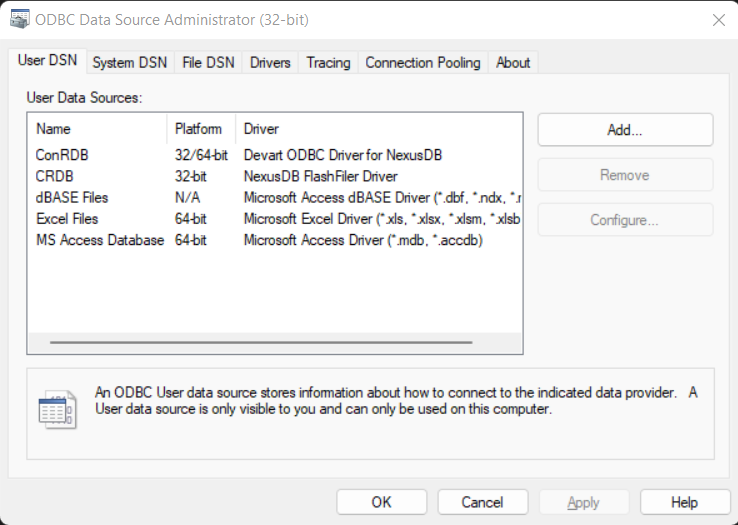
    <figcaption>It's there!</figcaption>
</figure>

I ended up using the IP-based connection, pointing at `localhost` on port 16000.

It even works properly in Visual Studio!

<figure>
    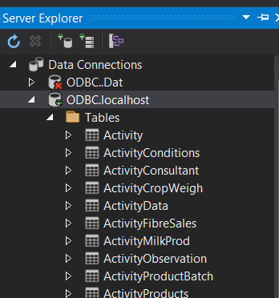
    <figcaption>The tables all display! And they will even tell you what's in them if you ask nicely</figcaption>
</figure>


Running my script from earlier, I get all the records I expect back into my JSON file, so I modify it a little to just... grab all the tables. No thinking needed :smile:

```cs
using Newtonsoft.Json;
using System;
using System.Collections.Generic;
using System.Data;
using System.Data.Odbc;
using System.Threading.Tasks;

namespace ConsoleApp1 {
    class Program {
        public static DataSet GetDataSetFromAdapter(DataSet dataSet, string connectionString, string queryString) {
            using (OdbcConnection connection = new OdbcConnection(connectionString)) {
                OdbcDataAdapter adapter = new OdbcDataAdapter(queryString, connection);
                try {
                    connection.Open();
                    adapter.Fill(dataSet);
                } catch (Exception ex) {
                    Console.WriteLine(ex.Message);
                }
            }
            return dataSet;
        }

        static async Task Main(string[] args) {
            Console.WriteLine("Hello World!");

            string connString = "DSN=ConRDB";

            List<String> tables = new();

            using (OdbcConnection connection = new OdbcConnection(connString)) {
                try {
                    connection.Open();
                    var schema = (connection.GetSchema("Tables").AsEnumerable().Select(r => r["TABLE_NAME"]));
                    foreach (var table in schema)
                    {
                        tables.Add(table.ToString());
                    }
                    connection.Close();
                } catch (Exception ex) {
                    Console.WriteLine(ex.Message);
                }
            }

            foreach (var tableName in tables) {
                string queryString = $"Select * FROM {tableName}";
                DataSet dataSet = new DataSet(tableName);
                try
                {
                    var ds = GetDataSetFromAdapter(dataSet, connString, queryString);
                    string json = JsonConvert.SerializeObject(ds, Formatting.Indented);

                    System.IO.File.WriteAllText(@$"C:\Users\user\Desktop\Projects\FarmOS Transfer\TransferProj\DbAsJson\{tableName}.json", json);
                    Console.WriteLine($"Done Reading {tableName}!");
                } catch (Exception e) {
                    Console.WriteLine("Got Error! {0}", e.Message);
                }
            }
        }
    }
}

```

And just for good measure, we'll write a TypeScript app that saves stuff as CSV too.

```ts
// app.ts
import odbc from 'odbc';
import * as csv from 'fast-csv';

console.log('Hello world');

type Table = { "TABLE_CAT"?: string, "TABLE_SCHEM"?: string, "TABLE_NAME": string, "TABLE_TYPE"?: string, "REMARKS"?: string }

async function connectToDatabase() {
    const connection1 = await odbc.connect('DSN=ConRdb');
    const tables: Table[] = await connection1.tables(null, null, null, null);
    const tableNames = tables.map(i => i.TABLE_NAME);

    let table = '';
    for (let i = 0; i < tableNames.length; i++)
    {
        table = tableNames[i];
        const res = await connection1.query(`SELECT * from [${table}]`);
        try {
            await csv.writeToPath(`C:\\Users\\user\\Desktop\\Projects\\FarmOS Transfer\\TransferProj\\DbAsCsv\\${table}.csv`, res, { headers: true });
            console.log(`Done reading ${table}.`)
        }
        catch (e) {
            console.error(e);
        }
    }
}

console.log('Starting Connection');
try {
    await connectToDatabase();
    console.log('Connected!');
} catch (e) {
    console.error(e);
}

console.log('Finished');
```

And we have all our data!

```csv
RecordID,ActivityID,RecTypeID,RecOwnerID,RecOwnerSubID,RecLandCropID,RecYear,ActivityDate,DataFieldID1,DataFieldID2,DataFieldID3,DataFieldID4,DataFieldID5,DataType1,DataType2,DataType3,DataType4,DataType5,FieldType1,FieldType2,FieldType3,FieldType4,FieldType5,ListID1,ListID2,ListID3,ListID4,ListID5,DataValue1,DataValue2,DataValue3,DataValue4,DataValue5,DataString1,DataString2,DataString3,DataString4,DataString5
1,188,0,5,-1,97,0,1899-12-30 00:00:00,21,22,25,24,0,3,3,3,3,,229,230,232,231,0,0,0,0,0,0,0,0,0,0,0,,,,,
6,183,0,1,-1,93,0,1899-12-30 00:00:00,21,22,25,24,0,3,3,3,3,,229,230,232,231,0,0,0,0,0,0,0,0,0,0,0,,,,,
28,1381,0,6,-1,119,0,1899-12-30 00:00:00,21,22,25,24,0,3,3,3,3,,229,230,232,231,0,0,0,0,0,0,0,0,0,0,0,,,,,
7,184,0,2,-1,94,0,1899-12-30 00:00:00,21,22,25,24,0,3,3,3,3,,229,230,232,231,0,0,0,0,0,0,0,0,0,0,0,,,,,
26,1306,0,6,-1,104,0,1899-12-30 00:00:00,21,22,25,24,0,3,3,3,3,,229,230,232,231,0,0,0,0,0,0,0,0,0,0,0,,,,,
15,1235,0,5,-1,112,0,1899-12-30 00:00:00,21,22,25,24,0,3,3,3,3,,229,230,232,231,0,0,0,0,0,0,0,0,0,0,0,,,,,
...
```

Now we just get to clean and link it! But that can be a job for another day.

## So what did we learn?

This whole experience was a real slow and painful grind towards success. 
Somehow I feel like every step with this kind of necromancy is an uphill battle, but if I did it all by hand, I'd still be going.

I think the main lessons can be seen as such:

1. Unless you control the entire lifecycle of your product (ie, the product dies when you kill its related WebAPIs), your product could easily outlive your company by decades. _Especially_ if your software is copied onto client's devices.
2. Source Code is meaningless without good directions to build it, including on exactly how to find dependencies.
3. Publicly Accessible Forum Posts (ie that Google can index) are absolutely vital to this kind of application necromancy. IMO, it's a public service to make things indexable, even if you just dump your forum posts and email chains into an indexer when you finish providing support.
   
   Discord, Slack and Telegram are not the same as a community forum, even if you are active there now and very nice and moderate everything.
   
   - As a younger developer, and especially a woman, I will try not to bother someone directly if I can just google the problem first.
   - I don't really want to add yet another slack channel to my list of places to be, just to figure out why I'm having some issue.
   - Making support public is good actually, both for now and in 20 years time.
4. Unfamiliar waters aren't a hard blocker for doing what you need, but you will need some luck to get there.
5. Is it a dead site? Or does it just have a classic look?
6. I'm glad I'm not writing software in the 90s, I really like my modern toolchains!

One day, I'm sure I'll look back at how we do knowledge sharing now in the same way I look at poorly formatted email chain dumps from 2000, but for now, I'm just glad they're around.

You never know who you will be helping by asking questions :smile: