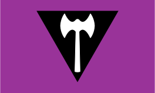
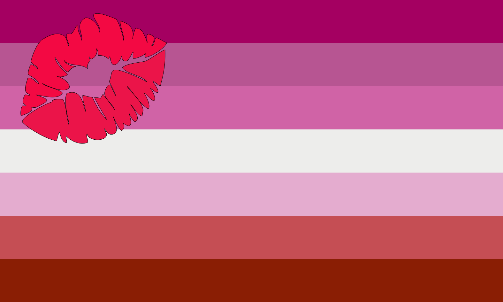
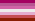
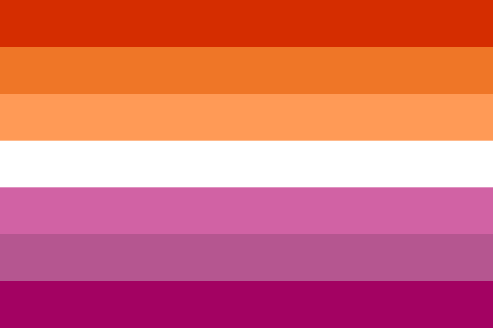
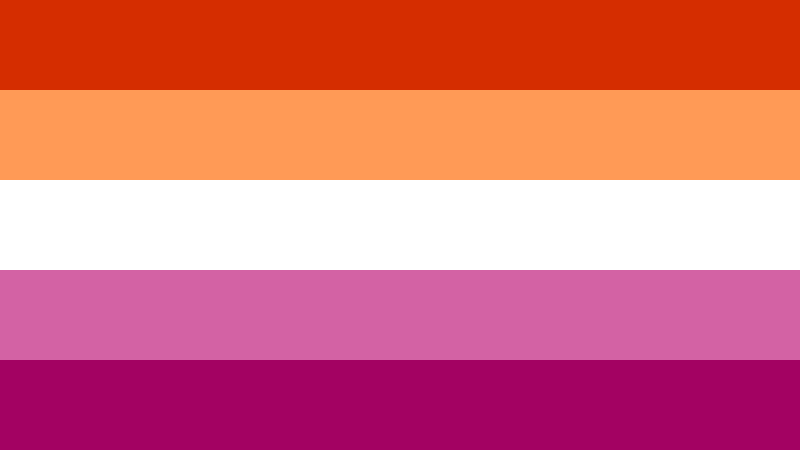

    

        <canvas id="GameCanvas" width="800" height="600"></canvas>
    

<!-- Polyfills bundle. -->

<!-- SystemJS support. -->

<!-- Import map -->

## About This Project

Ten Thousand Lesbians is a static art piece that renders 10,000 cubes of random size in random places within the camera's viewport.

The cubes choose 1 of the 7 colours from the modern Lesbian Flag (known colloquially as the _Orange Flag_ or the _Orange and Pink Flag_)

The camera rotates around the rendering, showing off all 10,000 cubes in their gorgeous gay attire.

## The History of the Lesbian Flag
The modern pride movement has an interesting history with flags. In current year, we've come to associate that most queer subcategories have their own flag and symbology, but this has not always been the case.

The first real pride flag, at least in the Anglophonic world, is the 6-stripe Rainbow Flag (&#127987;&#65039;&#8205;&#127752;) that we all know and love, created by Gilbert Baker in 1978. It's now impossible to walk through inner Melbourne without seeing the pride flag spread about, and thank the goddess for that. However it would be a long time before a lot of the other popular pride flags would come along, since most of the queer community would rally around the famous pride flag.
            
The main source for the following article is from the youtube video [History Of The Lesbian Flag(s)](https://www.youtube.com/watch?v=ubgPn6-fYkY) by creator [STRANGE AEONS](https://www.youtube.com/channel/UCrq3JYirgV-BLluzTF6X_7A).

### The _Labrys Flag_

<figure>
    
    <figcaption>Labrys Flag. Source: <a href="https://en.wikipedia.org/wiki/Lesbian_flags#/media/File:Labrys_Lesbian_Flag.svg">Wikipedia Commons</a></figcaption>
</figure>

While a number of MLM sub-communities would develop their own flags over the late 80s and early 90s (a lot of them were tied to various kink communities too, kink and pride have _always been linked_), the first WLW flag the community would create is the _Labrys Flag_ in 1999. It was created by Sean Campbell in the _Palm Springs Gay and Lesbian Times_, ran in a Pride Special where Sean basically just ideated flags for sections of the queer community.

The Labrys Flag is a Lavender flag containing a black inverted triangle in the centre. The triangle contains a _labrys_, a double headed ax that was commonly found in Minoan Cretan iconography.

Lavender, and similarly violet, is a colour commonly associated with queer, but especially lesbian communities. Modern queer historians believe the association likely started with a line from Sappho's _I Have Not Had One Word From Her_, a surviving poetry fragment describing a woman wearing "violet tiaras, braided rosebuds, dill and crocus twined around your young neck". Lesbians in the 1920s adopted the gifting of violets as the symbology for romantic intentions. Much later in 1969 USA, the president of the National Organization for Women would describe lesbians in the feminist movement as the "Lavender Menace" and of course who could resist immortalising that in their iconography, it sounds badass.

The black inverted triangle, like a non-zero amount of queer symbology, is reclaimed from the German Nazi Party, who used it as the concentration camp marker for "anti-social behaviour" of which lesbianism was considered. (Like, since they wouldn't have Aryan babies, of course they were anti-social). This is not to be confused with the Pink Triangle, which was infamously used (and has since been reclaimed) as the marker for gay men (and trans women) in concentration camps.  

The labrys, as mentioned, is common iconography in Minoan Crete, as well as in various depictions of Amazon warriors (the mythical all-women warrior band). Modern classical historians aren't sure why the labrys was so prevalent in Cretan iconography, but it has come to be associated with matriarchal power in the Mediterranean.

All of the above symbols were fairly well established in the lesbian community in the decades prior to the flag's creation, but the composition itself hadn't really been published before 1999.

Unfortunately, the labrys flag has been associated with Trans Exclusionary Radical Feminists for a very long time, and as such, shouldn't be used without first acknowledging this. Smaller modern reclamation attempts are underway because it's inarguably the coolest pride flag of them all, but it has not been re-adopted by the community wholly yet.

### The _Lipstick Lesbian Flag_

<figure>
    
    <figcaption>The Lipstick Lesbian Flag. Source: <a href="https://en.wikipedia.org/wiki/Lesbian_flags#/media/File:Lipstick_lesbian_Pride_Flag.svg">Wikipedia Commons</a></figcaption>
</figure>

The next identifiably lesbian flag was posted in 2010 on a now-deleted blog called _This Lesbian Life_ by designer Natalie McCray.

The flag itself was created with the intent of referencing similar sub-community flags used in the MLM community, such as the Bear or Leather flags, but for her own sub-community of _Lipstick Lesbians_.

The flag is a 7-horizontal-stripe flag using varying shades of pink, with a white stripe in the centre. It has a bold pink "Lipstick mark" in the top left of the flag.

The Lipstick Lesbian sub-culture has largely fallen out of use with many post-tumblr queer women, it really hit its stride in the mid-1990s. The subculture was mostly built around this particularly assimilationist, femme or high-femme aesthetic.  It was often fairly white, and probably the aesthetic they really created is the bulk of the lesbian representation we have in non-children's media as of 2022. The community was known to sort of really vibe themselves, where-in they'd claim that the 'best way to be a lesbian' would be to be sort of femme for femme, ie - femmes only dating other femmes.

Funnily enough, when I was a wee lass on the internet, and I read a description of what a lipstick lesbian was (ie high-femme, wanting to be made up and feel desirable, I didn't hear about the anti-butch vibes they had until much later) I kinda latched on to the label for a bit? I doubt that particular sub-community was particularly trans-inclusionary though, I might have had an interesting time trying to spend time there had I not been a pre-transition teenage girl, who didn't know she was a girl at the time, and wouldn't for another 5-6 years. Even better is that my own aesthetic could be called "femme" maybe once a week at best :p

This flag never took any real hold, being that it's for a sub-community that didn't include butch lesbians, has an annoying-to-reproduce icon in the lipstick mark, and also the creator went on to publish a whole bunch of racist, anti-butch, biphobic and anti-gender-non-conforming statements which is extremely uncool.

### The _Pink Flag_

<figure>
    
    <figcaption>The Pink Lesbian Flag. Source: <a href="https://en.wikipedia.org/wiki/Lesbian_flags#/media/File:Lesbian_Pride_pink_flag.svg">Wikipedia Commons</a></figcaption>
</figure>

The pink flag is directly derived from the lipstick lesbian flag, pretty much being the stripes of that flag without the kiss mark overlayed on it.

It was originally posted on Deviantart by an account simply called _Pride-Flags_ in 2015, and gained a reasonable amount of traction as the "official lesbian flag" when it was reposted in 2016 on tumblr by user _sappharah_.

Originally when I heard about this flag, I was told it was "the bad lesbian flag because it's transphobic" (and to use the orange flag instead), which is a simplification but not all incorrect if you trace the pink flag's history back to the lipstick lesbian flag.

### The _Orange and Pink Flag_

<figure> 

  

    
  

  

    
  

<figcaption>The Orange and Pink Lesbian Flag, both 7 and 5 stripe versions. Source: <a href="https://en.wikipedia.org/wiki/Lesbian_flags#/media/File:Lesbian_Pride_Flag_2019.svg">Wikipedia Commons</a></figcaption>
</figure>

The Orange and Pink flag (aka the Orange flag) is the most common lesbian flag in use today. First posted in June 2018 by tumblr user Emily Gwen, it basically won a few polls on tumblr in 2018, and saw a lot of use in art pieces since then.

The original version of the flag had 7 stripes, and then a simplified version with 5 stripes also fell into use in 2019. Both are good flags to use and generally accepted by the community.

The flag itself was a mash between the pink flag, and an orange version that was popular with a number of butch lesbians on tumblr at the same time, and this flag is generally considered a butch-positive flag.

Like a lot of post-tumblr culture, its propagation via fanart and other art pieces is probably the reason it's become fairly heavily accepted, although having your own wikipedia page helps too. I'm proud to contribute in my own tiny way with this work :D
