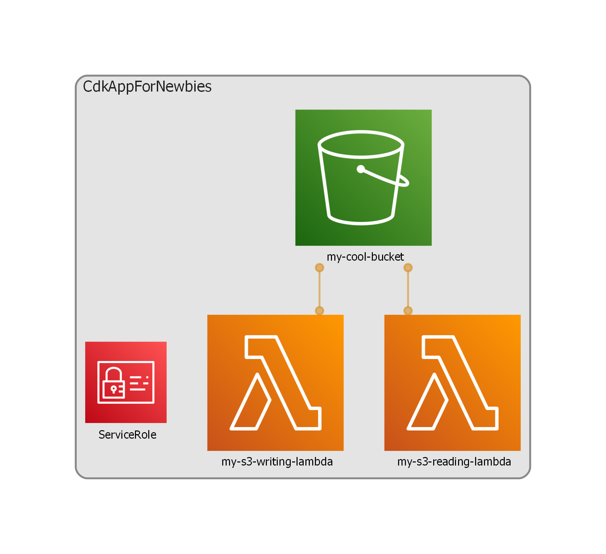

When I first encountered aws-cdk (Cloud Developer Kit) code, I was presented with an existing codebase that I couldn't really make heads nor tails of, in terms of what it was doing.
I found that most of the docs around CDK were pretty hard to parse for a beginner, and there wasn't really
an easy guide I could find to explain the basic concepts and structure.

This guide attempts to fix that, and also point out some common pitfalls that new users are likely to run into.

**Note**: This guide uses Typescript, and is mostly written from the perspective of a Serverless developer.

## So, what is CDK, and how does it work?

> Writing CDK is like doing "Object Oriented Cloudformation"

CDK is a typed, object-oriented build tool, that can be used to provision AWS Services using a 
high-level programming language that you are familiar with.

CDK code is *not* referenced inside application code (use `aws-sdk` for this), it's purely for development purposes.
It is, however, typically committed in the same repository as your application code, *especially* if you are writing
serverless applications.

Essentially, when you build your CDK application, you write TypeScript (or Java or Go or whatever) to describe 
your application's infrastructure (or AWS Service Map if you prefer), and you get a Cloudformation Template out.
It also has a bunch of tools for deploying the cloudformation template, which tracks changes between your 
"currently deployed state" and "new deployed state", meaning you can deploy your app, test it on the cloud,
make a change, and it will only deploy the delta between the two states.

## Concepts

AWS documentation describes a number of concepts, but I find their explanations for them
both a little vague and overly wordy.

We will briefly go over them here.

### App

Apps are somewhat ephemeral concepts, but they are a core part of the CDK system.

A CDK App doesn't have a counterpart as an AWS Service. You won't find an "App Portal" (at time of writing) in the AWS Web Console that aligns well with what we'd call a "CDK App".[^1]

The simplest description of an App is it's a "Collection of Related CDK Stacks".
Alternatively, it's the sum total of what your repo provisions.
If it helps, consider it the "Root Object" that CDK's functionality is based off.
You need the object to generate the cloudformation, but it doesn't do anything alone, and it won't show up in the Web Console.

[^1]: Technically, Systems Manager's AppConfig would be the closest thing, but it's really designed for another purpose, and that is out of the scope of this tutorial.

### Stack

A CDK Stack can be considered a "Unit of Deployment". It contains object definitions for all the AWS resources your application needs to run.

When you go to deploy your application, if you have multiple stacks defined, you will (usually) tell CDK which stack you are wanting to deploy.

CDK Stacks have a 1:1 relationship with Cloudformation Stacks. You can view your CDK stacks in the Cloudformation portal in AWS.

**Note:** This tutorial will not go into multi-stack or cross-stack design.

### Constructs

Constructs are Objects (in the OOP sense) that represent an AWS resource or Collection of AWS resources.

Generally speaking, you won't have to write your own constructs when you're writing an app, you will just instantiate and configure versions of constructs that have been provided by AWS or other developers.

As a rule, you should start building your infrastructure code directly inside a stack definition,
before you start thinking about splitting things off into their own separate constructs or classes.

A Stack is a special case of a Construct, in that `Stack` inherits from `Construct` in the CDK library hierarchy,
and the Stack has extensions for defining where it is deployed in AWS, and allows you to tag all its children.
Constructs, conversely, don't generally care about which AWS Account or Environment they're being deployed in,
and more often than not should not be aware of such things.

Constructs are added to the stack as soon as their constructor is called, irrespective of if it is
assigned to a variable or class property. It's told where it belongs in the hierarchy by the `scope` argument,
which is usually going to be set to `this` of its containing construct.

AWS, and CDK developers as a whole, may sometimes refer to the "Level" of a construct, which is an AWS term that describes how construct features are abstracted.
Below are some basic definitions for them.

#### L1 Constructs

L1 Constructs are basically auto-generated objects that relate directly to an AWS service.

L1 Constructs **always** start with the `Cfn` prefix. Ie: `CfnBucket`, `CfnSecret`, `CfnOutput`.

Generally speaking, you want to avoid using L1 constructs where possible, as they don't have as many useful
features or well-defined defaults. This may not always be possible, but it's very much worthwhile checking if an 
"L2" construct exists for your service, since they allow much more succinct CDK code.


#### L2 Constructs

L2 Constructs are the meat and potatoes of your CDK application's infrastructure code. 
They usually represent an AWS resource (like a `Bucket`, a `Function` or a `Queue`), *PLUS* the sane layer of 
actions one could take on said resource (like allowing something to read from it, or invoke it), 
which are usually exposed as Class Methods.

Generally, L2 constructs `grant` permissions to other constructs. It's rare to see constructs `request`ing
permissions. This has implications for code layout we will discuss later.

L2 Constructs *never* start with `Cfn`, ie they are called `Bucket`, `Function`, `Queue`, etc.

For clarity:

| AWS Service | L1 Construct Name | L2 Construct Name (**Use these!!**) |
| --- | --- | --- |
| S3 Bucket | `CfnBucket` | `Bucket` |
| SQS Queue | `CfnQueue` | `Queue` |
| Lambda Function | `CfnFunction` | `Function` |

##### Why L2 Constructs? An Example

For example, lets say we have a (very basic) application:

A Lambda Function that takes a fileName as an input parameter, tries to read that file from an S3 bucket, and return the results in the response payload.

The Lambda Function needs to know the Name of the S3 Bucket so it knows where to look for the file.
It also needs "Read" permissions for that S3 Bucket, so we can read the contents of the file.

With L1 constructs, on top of the Lambda Function and the S3 bucket, we'd also need to create IAM policies
for the function to read from S3, which involves a lot of strings and looking up exactly which `S3:ListObjects`, `S3:GetObjects`, etc. actions you need to actually read a file.

With L2 constructs, `aws-s3.Bucket` exposes a function called `grantRead()`, which you can call on the lambda construct, and it will set up the correct, minimum-required permissions the function needs, only on that function, to read a file from that bucket.

#### L2.5 Constructs

Sometimes you might see a developer reference "L2.5" constructs. This is usually just an L2 construct with some
default properties set, for example:
-  Lambdas that always have Active XRay Tracing turned on
-  A WebACL that exposes an extra method, just to allow a slightly easier time of configuring something with it, because maybe it's tricky or messy to set up the default ACL definition.

If these are made available within your organisation, I would use them over the raw AWS constructs, as often
they conform to a sensible default policy, or add some extra little setup options like routing logging
to the correct provider.

#### L3 Constructs

L3 Constructs represent a collection of L2 constructs which are designed to complete some discrete task.

For example, if you want to create a lambda function that reads off an SQS Queue, your L3 construct for this
might provision both the lambda function, the SQS Queue, and a Dead Letter Queue for that lambda to use.

These come in handy if you have a fairly common infrastructure pattern within your organisation.
Even more-so if it's kinda easy to mess up defining it properly.

Generally you won't be writing L3 constructs as part of regular application code, and I'd advise against
it until you're comfortable with how the whole build system works.

### Synth-ing

Synthing is the action of turning your CDK Application into a Cloudformation Template.

It's a totally offline action, it doesn't contact AWS services, and it's idempotent.
Also: It's completely synchronous. CDK doesn't support Async code at all - it's supposed to be deterministic after all.
This means you can't create a construct that, say, reads some value from a database to determine some config variable.[^3]

[^3]: You could, theoretically, use a bash script to read from a DB, and write the result to an EnvVar before synthing.
    However, there are not many good reasons to actually do this, and plenty of good reasons not to.

    If you're writing a smartass construct that relies on this behaviour, make sure to account for this EnvVar not being set :p

**Note:** If you are using NodejsFunctions in your application, CDK will also bundle and compile your application code during the synth process.

## Alright, lets write a CDK App

I usually struggle with consuming example code for this kind of thing. Most examples are either too simple, and fail to
communicate how to actually structure an application in a sane way, or they don't explain why something is structured
the way it is.

So, in advance, I apologise for the length of the next section, but hopefully it demonstrates the core concepts.

Completed code samples for this section may be found [in this github repo](https://github.com/PhalanxHead/CdkAppForNewbies)

**Note:** The directory structure is listed in the Appendix, for the context of layout.

### App Goal

Two Lambda Functions, one that can read from an S3 Bucket, and one that can write to it.
We will trigger these through the web test console, and keep in mind this isn't a lambda tutorial, so the code is designed to be simple without being silly.

### Intended Learning Outcomes

- The Anatomy of a CDK App
- How to instantiate a CDK Construct
- Common Pitfalls, and how to avoid them

### Getting Started

I'm going to use the `awscdk-app-ts` project type from [projen](https://github.com/projen/projen) to get started.
If you're not familiar with projen, don't worry, it's not required or anything, and I won't explain anything about it here.
Just know, it's a great way to get started with your cdk projects, knowing that they are generally structured to
work out of the box.

### Entrypoint - `main.ts`

When writing CDK code, life begins at `main`.
This file will contain our `App` reference, and a list of all our stacks.

```ts
// src/infra/main.ts
import { App } from 'aws-cdk-lib';
import { MyStack } from './my-stack';

const app = new App();

new MyStack(app, 'CdkAppForNewbies', {
    env: {
        account: process.env.CDK_DEFAULT_ACCOUNT,
        region: process.env.CDK_DEFAULT_REGION,
    },
});

app.synth();
```

**Some dissection:**

Firstly, we can see our App doesn't take any parameters or config. As I said, it's really just a root object.

Next, we can see that the `MyStack` definition has a few bits to it:

- We pass the `app` reference in, so the Stack knows to which object it belongs.
- The stack has a name, or 'id', which is `CdkAppForNewbies` in this case. This ID needs to be unique amongst the stacks in the app. We couldn't create a second stack called `CdkAppForNewbies`.
- The stack takes in an account and region setting, to tell AWS where exactly we want our infrastructure to go.
    In this case, we are reading from the system's environment variables to find that, which will be extracted when the app is `synth`ed.[^2]

Finally, we see a call to `app.synth()`, which is the CDK command to turn the app into a set of cloudformation templates.

[^2]: If you're writing cdk for an organisation, it's quite possible they have the account IDs available in a
    library somewhere. I find this gives a better at-a-glance view of where an app is going than using the system env vars.

### Stack Definition - `my-stack.ts`

Next we will write our stack code.

```ts
// src/infra/my-stack.ts
import { App, Stack, StackProps } from 'aws-cdk-lib';
import { Architecture } from 'aws-cdk-lib/aws-lambda';
import { NodejsFunction } from 'aws-cdk-lib/aws-lambda-nodejs';
import { RetentionDays } from 'aws-cdk-lib/aws-logs';
import { Bucket, BucketEncryption } from 'aws-cdk-lib/aws-s3';

export interface MyStackProps extends StackProps {}

export class MyStack extends Stack {
  constructor(scope: App, id: string, props: MyStackProps) {
    super(scope, id, props);

    const myCoolBucket = new Bucket(this, 'my-cool-bucket', {
        encryption: BucketEncryption.KMS_MANAGED,
    });

    const myReadLambda = new NodejsFunction(this, 'my-s3-reading-lambda', {
        entry: 'src/app/read-function-handler.ts',
        environment: {
            BUCKET_NAME: myCoolBucket.bucketName
        },
        architecture: Architecture.ARM_64,
        logRetention: RetentionDays.ONE_DAY,
    });
    myCoolBucket.grantRead(myReadLambda);

    const myWriteLambda = new NodejsFunction(this, 'my-s3-writing-lambda', {
        entry: 'src/app/write-function-handler.ts',
        environment: {
            BUCKET_NAME: myCoolBucket.bucketName
        },
        architecture: Architecture.ARM_64,
        logRetention: RetentionDays.ONE_DAY,
    });
    myCoolBucket.grantWrite(myWriteLambda);
  }
}
```

**Some dissection:**

Okay there's a little bit to unpack here.

Firstly, we are creating an interface called `MyStackProps`, that extends the generic `StackProps`.
This can be used for generic CDK configuration, (ie, passing configuration parameters in at compile-time).
Configuration like this is out of scope for this tutorial.

Next, we can see we are defining a `Stack` called `MyStack`, the constructor for which is what we are calling
in the `main.ts` definition.
As mentioned, the constructor takes:
- An `App` for the scope (where in the project it lives)
- An `id` field, which we called `CdkAppForNewbies` before
- Some `props`, which were the AWS Deployment environment variables.
    These may include some compile-time configuration for the CDK, like names and URLs that aren't likely
    to change.

##### S3 Bucket

In the constructor, we create a `Bucket` as a constant, which we have IDed as `my-cool-bucket`. 
Note the scope of the Bucket is `this`, meaning this stack. Generally, all constructs are scoped to their
parent construct (ie, the class they're being defined in). You can see this scoping if you look through
the cloudformation page for the stack when you deploy.

Finally, we configure the bucket to use KMS encryption, which means AWS is in charge of encrypting the
bucket contents, and managing the encryption keys for it.
All constructs are configured this way, by passing in a `props` object.
Generally, the default configuration of a construct is valid (meaning you can leave the `props` parameter undefined),
but keep in mind that these default configurations don't always conform to a security policy, or even the goal
you're seeking with the infrastructure.

##### Read Lambda function

Next we generate a `NodejsFunction` with an id of `my-s3-reading-lambda`. Very well named, obviously :stuck_out_tongue:.
We tell CDK where to find the <abbr title="The entrypoint for the lambda function, usually an exported closure called 'handler'.">handler function</abbr> with the `props.entry` path string[^4], 
and we set some basic configuration:
- Architecture, because ARM is cheaper,
- log retention, because we don't need to store logs forever, which I believe is the default policy for some reason.

We also set the Environment Variable `BUCKET_NAME`, which we can use in the app code to find the S3 bucket, using the
variable `process.env.BUCKET_NAME`.[^5]

[^4]: AWS docs don't say clearly, but the `entry` property is supposed to be defined from the project root (ie, the directory containing `package.json`)

[^5]: Values that need to be accessed at runtime (like bucket names and other ARNs) should generally be passed in
via environment variables.

For the sake of completeness, here's the lambda code. We won't revisit this again for now.


```ts
// src/app/read-function-handler.ts
// You won't win points for using this code, but it does work.
import { S3Client, GetObjectCommand } from '@aws-sdk/client-s3';

export type ReadRequest = {
    fileName: string;
};

export const handler = async (event: { body?: string }): Promise<{ statusCode: number; body: string }> => {
    try {
        const request = JSON.parse(event.body ?? '') as ReadRequest;

        const s3Client = new S3Client({});
        const s3Response = await s3Client.send(
            new GetObjectCommand({
                Bucket: process.env.BUCKET_NAME,
                Key: request.fileName,
            })
        );
        console.log('S3 Response', s3Response);

        return {
            statusCode: 200,
            body: JSON.stringify({ fileName: request.fileName, fileContent: s3Response.Body }),
        };
    } catch (err) {
        console.error(err);
        return {
            statusCode: 400,
            body: 'Reading from S3 Failed!',
        };
    }
};
```

We grant this lambda permissions to read from the bucket.

##### Write Lambda function

Finally, we generate a `NodejsFunction` with an id of `my-s3-writing-lambda`. All the settings are the same,
apart from we grant it write permissions for the bucket instead.

Here's the handler code, for completeness sake once again.

```ts
// src/app/write-function-handler.ts
import { S3Client, PutObjectCommand } from '@aws-sdk/client-s3';

export type WriteRequest = {
    fileName: string;
    fileContent: string;
};

export const handler = async (event: { body?: string }): Promise<{ statusCode: number; body: string }> => {
    try {
        const request = JSON.parse(event.body ?? '') as WriteRequest;

        const s3Client = new S3Client({});
        const s3Response = await s3Client.send(
            new PutObjectCommand({
                Body: request.fileContent,
                Bucket: process.env.BUCKET_NAME,
                Key: request.fileName,
            })
        );
        console.log('S3 Response', s3Response);

        return {
            statusCode: 200,
            body: 'Success',
        };
    } catch (err) {
        console.error(err);
        return {
            statusCode: 400,
            body: 'Writing to S3 Failed!',
        };
    }
};
```

##### Diagram the Stack

So now we have a stack, we can synth the code and get out an application.

```bash
npx cdk synth
```

We can inspect the output in the `./cdk.out/` directory if we're really keen -- it contains all the app bundles,
as well as the Cloudformation code we need to deploy the app.

It's at this point I want to introduce a new tool to you, called [cdk-dia](https://github.com/pistazie/cdk-dia).
It's basically just a diagram generator that reads the CDK output and draws a picture of all the defined resources.

Despite its simplicity, however, I believe it's the single best tool you can use to help write better CDK code.
Alongside pointing out the boundaries of your stacks and constructs, it also describes which resources are
related to each other. Oftentimes if you know two resources are linked, but the link isn't shown in the diagram,
it means there's a better way to write your stack definition.

The diagram it spits out for our app looks like so:



Sure, this diagram is very basic since our app is, but it does show us that both our lambdas (are at least allowed to) interact with the bucket.
As your apps get more and more complicated, or if you start to take on other people's CDK code, you may find --
as I have -- that this tool massively cuts down on trying to work out how all the pieces fit together.

Also, since it's auto-generated, it can't lie, unlike hand-drawn diagrams :D

This is definitely the simplest kind of stack we could write. 
There are no class properties, and no methods in the class. There's no extra logic or conditionally
setting up infrastructure or setting environment variables based on the presence of infrastructure.

But, this is a whole application. It doesn't need to be any more complicated. 
You don't need to write your own constructs unless you have a really compelling reason to.

## Useful Principles and how to breach them

CDK is reasonably new to our organisation, so I've seen a number of common mistakes in CDK code that
are mostly the result of copy-paste, trial by error, and generally just newbie errors that shouldn't have
made it past code review.

I'll detail some principles around them below.

### Resources that are "accessed" are defined at the start of the stack

We're talking things like Databases, Secrets, Parameters and "providers" like email services, etc.

> Constructs typically "grant" access, not "request" it.

Knowing this, you'd think it'd be obvious, but I've seen enough times that developers will just create a
Database at the bottom of the stack constructor, and then try to write around that odd choice
by writing IAM policies out themselves, which is always wordy and hard to get right.

### You ain't gonna need it (your own Construct, that is) 

The first app I ever saw in CDK was pretty simple - a RestAPI with 3 Lambda functions, a DB table,
and a WebACL on the RestAPI, as well as Domain Name records.

Somehow, in all that, I believe there were about 3 or 4 constructs defined as well as the Stack, which
was very confusing to me as a newbie (who didn't really know how properties were passed or synthing worked)

Since then, I've seen this kinda mistake repeated over and over in the organisation, in some cases leading to
some *very* confused CDK, and pretty poor permissions policies as a result.

Simplest principle is this:

1. **Write out all the resources you need in the stack, with consumables at the top.**
2. **Grant all the permissions your app needs, as much as you can using L2 Construct Methods.**
3. **Related Lambdas go next to each other.**

    If you're writing microservices, this should not be something you're thinking about much, but
    sometimes you might find some patterns that *seem* to make sense, so go with your gut. 
4. **Stare at your code and ask *"do I gain anything by putting this in its own file?"***

    I'd argue the answer is usually "No". <br />
    Remember, this is build-time code, you don't need to apply
    SOLID principles within an inch of its life. Performance doesn't matter, readability *does*, and there's a
    good chance you'll be reading it from GitHub, so being able to find stuff easily is good! <br />
    You *do* probably want to add a heap of comments about why you're doing stuff though.

### Constructs are supposed to *do* stuff, not *house* stuff

Since I have just said "don't write your own construct," this seems like odd advice, but let me explain my rationale.

A lot of newer developers tend to write a Construct 'specially for their Database or WebACL or whatever, and
all that's in the construct class is that one L2 construct.

I feel like this probably comes from the classical OOP idea of creating adapter objects or something, I'm not really sure.

Anyway, since this construct class only has one item in it, I'd argue it's 'housing' the resource, which isn't really
what constructs are for.

Notice the design of the `Bucket` construct, it create an S3 Bucket, and then `grants` access to other AWS resources
(which in the background does some clever with with IAM policies)

Our resource house doesn't really do that, does it?

An example of a construct *doing* something would be:

> A construct that helps send emails. It has an SQS Queue, a Lambda, and creates an `EmailIdentity` to send emails with. <br />
> The construct exposes a method that is `grantSendEmail()`, that allows the grantee access to sending messages to the Queue. <br />
> The lambda reads these email requests from the Queue and sends emails based on them.

### Try not to write your own IAM Policy

IAM policies are what's required to grant resources access to stuff, but it's usually implicit in L2 construct methods.
If you find yourself reaching for that `new aws_iam.Policy()` line, see if you can't restructure your CDK to avoid it.

It's not always possible, for example some resources like `Pinpoint` don't have L2 constructs, but generally
you're less likely to make a mistake if you don't write your own Policy.

### Use tags to identify your stuff

This is more of an organisation-level policy, but if you're sharing an AWS Account with other teams,
you may frequently find yourself wondering "huh, what's *that* resource from?" as you browse around the web console.

You can also use the tags with static analysis tools to figure out what stuff is and isn't your responsibility.

### Don't stress about constructor length

There's an older OOP attitude that says to keep constructors short, and use methods instead.

It makes sense in app code, to an extent, but I question it for infra code.

I don't think you gain anything substantial by doing the first over the second:

```ts
// I guess you could do this?
export class MyStack extends Stack {
    readonly bucket: IBucket;
    readonly puppyGeneratorLambda: IFunction;
    readonly puppyServerLambda: IFunction;

    constructor(scope: App, id: string, props: StackProps = {}) {
        super(scope, id, props);

        this.setupAllMyInfra(props);
    }

    private setupAllMyInfra(props: StackProps) {
        this.bucket = new Bucket(this, 'photos-of-puppies');

        this.puppyGeneratorLambda = new NodejsFunction(this, 'puppy-generator', {/** ... */});
        this.bucket.grantWrite(this.puppyGeneratorLambda);

        this.puppyServerLambda = new NodejsFunction(this, 'puppy-server', {/** ... */});
        this.bucket.grantRead(this.puppyServerLambda);
    }
}
```

```ts
// But I don't see the problem with this
export class MyStack extends Stack {
    readonly bucket: IBucket;
    readonly puppyGeneratorLambda: IFunction;
    readonly puppyServerLambda: IFunction;

    constructor(scope: App, id: string, props: StackProps = {}) {
        super(scope, id, props);

        this.bucket = new Bucket(this, 'photos-of-puppies');

        this.puppyGeneratorLambda = new NodejsFunction(this, 'puppy-generator', {/** ... */});
        this.bucket.grantWrite(this.puppyGeneratorLambda);

        this.puppyServerLambda = new NodejsFunction(this, 'puppy-server', {/** ... */});
        this.bucket.grantRead(this.puppyServerLambda);
    }
}
```

I guess you could argue it makes sense to turn the Lambda Function creation into its own method, since it 
will probably be repeated a few times, but my instinct wouldn't be to start this way, you're just adding
indirection for the sake of it.

## A note on CDK IDs

The ID of a CDK construct is required, but not magical.

- It has to be unique within the construct's `scope` (ie. you can't have 2 lambda functions with ID 'my-function' in the root of a stack)
- The ID is *not* the same thing as a construct's `name`, which, if set, has to be unique within the construct's
AWS Environment (ie. Account + Region).
- If a construct's name is not set, CDK will auto-generate a name for it based on the CDK `path`.

    It'll usually be something like `<stackId>-<parentConstructId>-<constructId>-<8LetterHash>`, 
    but it's not always a readable value, if the path is too long, it'll start stripping letters.
- The ID can't be used inside app code, it's not the same as an ARN.

Best practice for setting ID constructs is to set them to what they _do_, not necessarily what they _are_.

If you're using a tool like `cdk-dia`, and you get some DynamoDB table called 'table' in your diagram, it'll drive you nuts. All the worse if it's already deployed.

The ID of a construct is how CDK knows not to create it a second time (or delete it).
Generally speaking, if you change a construct's ID, CDK will try to create a new version of it, with varying effects.

**Note**: CDK's deployment strategy is:
1. Create
1. Update
1. Destroy

This has the following effects for the following cases:

- I have a lambda function with the default name, and I changed it's CDK ID.
  - Deployment will work fine
  - Any changes to the function in the web console will be lost and overridden by what's set in CDK
  - (It's created a new function and then destroyed the old one)
- I have a lambda function with a special name, and I changed it's CDK ID
  - Deployment will fail, because it will attempt to create a second function with the same name in the same environment. This isn't allowed.
- I have a DynamoDB Table with 1GB of data in it, and I changed its CDK ID.
  - A new DynamoDB table with no data in it will be created
  - Depending on the table's `RemovalPolicy`, the existing data may be destroyed.
- I have some Route53 DNS Records and I changed the CDK ID of them
  - Deployment fails, as you can't have 2 copies of the same DNS records in a DNS table.
  - It's attempted to create a second set of DNS records before deleting the first set. Not allowed.

## Conclusion

So now we have written our own little CDK App of the most simplistic style.

Most apps aren't fundamentally that much more complicated than this, I've found, and don't need to be.

Some simple design rules are this:

1. Stick to the Stack
2. Resources that are dependant (ie, lambdas) go at the bottom, resources that provide (ie, databases, buckets) go at the top of the stack definition.
3. Stacks are Objects, you *may* use methods. But really consider why you what to do this.
4. Don't overthink it. CDK doesn't need to be complicated.

## Appendix

### App Directory Structure

```
/
|-- src/
|-- |-- app/
|-- |-- |-- read-function-handler.ts
|-- |-- |-- write-function-handler.ts
|-- |-- infra/
|-- |-- |-- main.ts
|-- |-- |-- my-stack.ts
|-- test/
|-- package.json
```
