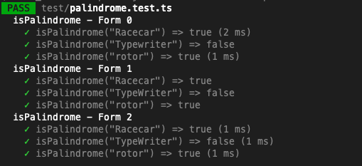

## Unit Testing in Typescript/NodeJS

Unit testing is a vital part of writing stable backend software. It's even more important in a dynamic language environment like NodeJS, as it doesn't have a strict type system to catch a lot of seemingly simple errors.


A number of different testing frameworks exist, and each have their own quirks.
  

Testing units with Jest
-----------------------

Jest is a test and mocking framework built in and for NodeJS. Typescript compatibility has been built over the top of it, but a lot of the legacy documentation has been written for older Js in mind first.
  

The basic intent, as with all unit testing, is to take some public element of your codebase (a unit if you will), and ensure that it works the way you expect under all input conditions. This can help us detect the cause of bugs early while building, and when a change has created a problem later on.
  

Jest has a series of different key functions we can use to organise and run our tests. Here's the main few:
  

```typescript
describe('group description', () => {});
// Describe is used to group logically similar test cases.
// You can nest these as many times as needed. 
// Expect() statements do not go into describe() blocks directly.

it('test description', () => {});
test('test description', () => {});
// It and Test are aliases of the same thing. 
// No preference for either, apart from how you phrase your test descriptions. 
// it('Returns a positive result when adding 2 positive numbers', () => {})
// is preferred over
// test('If it returns a positibe result when adding 2 positive numbers', () => {});
// As it's more obvious what the test is expecting when it fails.

expect();
// expect is the assertion clause that Jest uses. It has 2 basic forms:
// 1: Matching a result with an expectation:
expect(myFunction('Hello', 'World!')).toBe('Hello World!');
// 2: Checking for an error
expect(() => { myFunction('Hellow', 'World') }).not.toThowError();
```

  

When put together, normal, synchronous testing might have a structure like this:

```typescript
describe('testModule/Class', () => {
  describe('public function being tested', () => {
    it('specific behaviour being tested 1 - Eg "Adding 2 positive integers gives the positive sum"', () => {
      expect(add(2,2)).toBe(4);
    });

    it('specific behaviour being tested 2 - Eg "Adding a positive and negative integer gives the signed difference between their absolute values"', () => {
      expect(add(2,-2)).toBe(0);
    });

    it('specific behaviour being tested 3 - Eg "Adding two negaive integers gives the negative sum"', () => {
      expect(add(-2, -2)).toBe(-4);
    });
  });
});
```

Generally speaking, less assertions per-test (ie, per `it()` statement) will give more reliable results. Jest has been known to ignore failing `expect()` statements if several (>5 maybe?) are stacked.

Writing good unit tests with descriptive labels also has the advantage of acting as documentation for a specific service. Comments and requirements docs may fail to be updated at some point, but tests must pass to be deployed, so it is helpful to write more, smaller tests.

  

A more explicit form of Arrange/Act/Assert might look like so:

```typescript
describe('testModule/Class', () => {
  describe('public function being tested', () => {
    it('specific behaviour being tested 1 - Eg "Adding 2 positive integers gives the positive sum"', () => {
      const inputDataA = 2;
      const inputDataB = 2;
      const expectedOutputData = 4;

      const actualResult = add(inputDataA, inputDataB);

      expect(actualResult).toBe(expectedOutputData);

    });
  });
});
```

Obviously this is a fairly contrived example, but your data may be a lot more complex - ie data produced by faker or a very long string.

  

### Basic Matchers

Jest has a fairly extensive list of basic matchers, found here: [Expect · Jest (jestjs.io)](https://jestjs.io/docs/expect)

  

A few main tripping points that you'll probably forget:

```typescript
expect().toBe() // Checks if 2 objects are the same *instance*
expect().toEqual() // Checks if 2 objects have equal properties (preferable I think)

expect().toBeCloseTo() // use this for floating-point equality testing.
```

  

### More advanced matchers

In some cases, we may want to use more advanced matching techniques when asserting certain responses.

For example, it may be beneficial to ignore the exact timestamp generated by a service response, but to simply assert that there is one.

We can used more advanced matchers (detailed here: [The hidden power of Jest matchers | by Boris | Medium](https://just-boris.medium.com/the-hidden-power-of-jest-matchers-f3d86d8101b0)) to test the interesting elements of the response.

  

Examples:

```typescript
// Expecting a date, but without any care for the contents
const comment = createComment('test content', 'author@me.com');
expect(comment).toEqual({
  createdAt: expect.any(Date),
  content: 'test content',
  author: 'author@me.com'
});
```

  

```typescript
// Partial match an object on specific keys
const user = prepareUserInfo('test-user'); 
// user object is something like ... 
// {
//   id: 123,
//   name: 'test-user',
//   profile: {...},
//   passwordHash: '*****',
//   whatever: {...}
// }
// ... but for the test we are interested only in name and id
expect(user).toEqual(expect.objectContaining({
  id: 123,
  name: 'test-user'
}));
```

  

```typescript
// Checking a mocked service was called, formatting an input argument exactly.
test('Sends an email with all the listed items present, separated by newlines', async () => {
    const sendMail = jest.fn();
    const testLines = [
        `This is item 1`,
        `This is another item`,
        `Oh wow, yet another item!`,
    ];
    await manage.sendLinesEmail(testLines);

    expect(sendMail).toHaveBeenCalledTimes(1);
    expect(sendMail).toHaveBeenCalledWith({
        from: expect.any(string),
        to: expect.any(string),
        subject: expect.stringContaining('Preconfigured subject line!'),
        text: expect.stringContaining(`\n${testLines.join('\n')}`),
    });
});
```

  

---

Repeated Tests with \`it.each()\`
---------------------------------

Sometimes you will have a set of tests that all look very oddly similar, but use ever so slightly different data and results. Not to worry, we can write the test code once and insert our own data layout using the `it.each()` function. This will also let us use the values in the test name.

  

Let's say we are testing the following function, since it's fairly simple.

```typescript
// src/palindrome.ts
function isPalindrome(word: string): boolean {
	return word.toLowerCase() === word.toLowerCase().split('').reverse().join('');
}
```

  

### Form 0: Individual Tests

The default way to write a test suite is to use individual `it()` statements for each test.

```typescript
// test/palindrome.test.ts
describe('isPalindrome - Form 0', () => {
	it('isPalindrome("Racecar") => true', () => {
		expect(isPalindrome('Racecar')).toEqual(true);
	});
	it('isPalindrome("Typewriter") => false', () => {
		expect(isPalindrome('Typewriter')).toEqual(false);
	});
	it('isPalindrome("rotor") =>', () => {
		expect(isPalindrome('rotor')).toEqual(true);
	});
});
```

This certainly works, but it violates the `DRY` principle - Don't Repeat Yourself. We can do better!

  

### Form 1: Input data as an array of Arrays

You can specify a test data suite as an "Array of Arrays" if you like, where each inner array is equal to one test data set. Example:

```typescript
// test/palindrome.test.ts
describe('isPalindrome - Form 1', () => {
	it.each([
		['Racecar', true],
		['TypeWriter', false],
		['rotor', true],
	])('isPalindrome("%s") => %s', (testWord, expectedResult) => {
		expect(isPalindrome(testWord)).toEqual(expectedResult);
	});
});
```

This gives us a few nice qualities, and has some downsides.

Firstly, we write the test code once, and yet it runs multiple times!

We also can inject the parameter values from the test into the test name (using `%s` formatting)!

It also means that adding more test cases is as easy as adding a new line to the array.

  

Unfortunately, it has the downside of not really labelling the parameters. If you're not so familiar with JS, it might not be obvious that `'Racecar'` is being inserted as `testWord`, but that's not a huge deal.

  

We do have another option:

  

### Form 2: Input Data as Tagged Template Literals

Tagged Template literals is a concept in JS of using the backtick characters (`` ` ``) to format strings.

In this case we get to create a testing table as below:

```typescript
// test/palindrome.test.ts
describe('isPalindrome - Form 2', () => {
	it.each`
		testWord        | expectedResult
		${'Racecar'}    | ${true}
		${'TypeWriter'} | ${false}
		${'rotor'}      | ${true}
	`('isPalindrome("$testWord") => $expectedResult', ({ testWord, expectedResult }) => {
		expect(isPalindrome(testWord)).toEqual(expectedResult);
	});
});
```

Note the differences between this and `Form 1`

*   `it.each([])('', ()={})` is now called like `it.each``('', () => {})`
*   The parameters in the test name are now labelled, instead of using `%s`
*   The arguments to the test are now using `({ testWord, expectedResult }) => {}` instead of `(testWord, expectedResult) => {}`
*   The columns have labels!
*   Test values are wrapped in `${}` . This is required, even for string arguments.

If you're using ES Lint and Prettier, it will even clean up the table formatting for you, so all of your columns are well aligned!

  

The final advantage is that the column order doesn't have to follow the argument order in the test parameters - the column names just have to match. ie: the following will also work!

```typescript
describe('isPalindrome - Form 2', () => {
	it.each`
		expectedResult | testWord
		${true}        | ${'Racecar'}
		${false}       | ${'TypeWriter'}
		${true}        | ${'rotor'}
	`('isPalindrome("$testWord") => $expectedResult', ({ testWord, expectedResult }) => {
		expect(isPalindrome(testWord)).toEqual(expectedResult);
	});
});
```

  

In any case, the results will give you tests that print out like this when you run them:


  

Using `it.each()` may not be applicable for all test input data, for example if sometimes the test should throw an `Error`.

